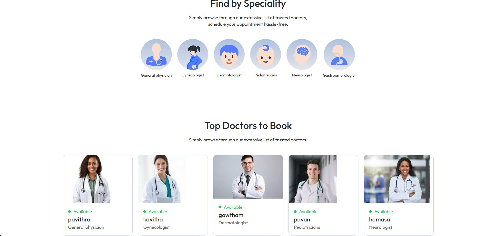
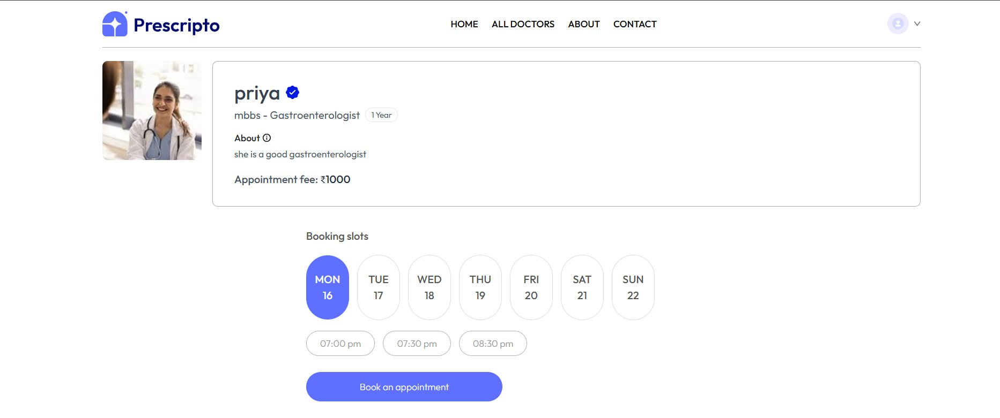
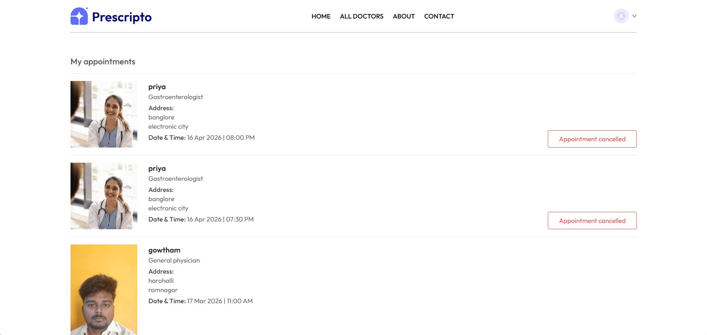
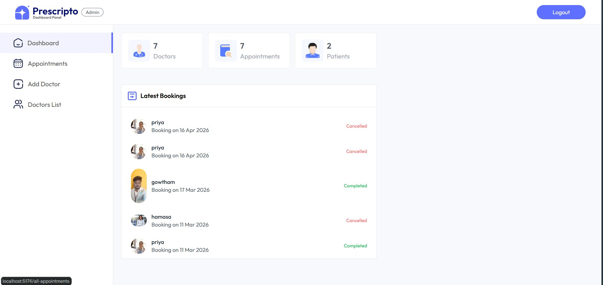
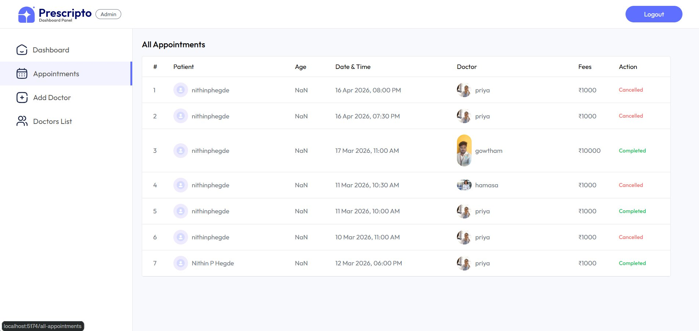
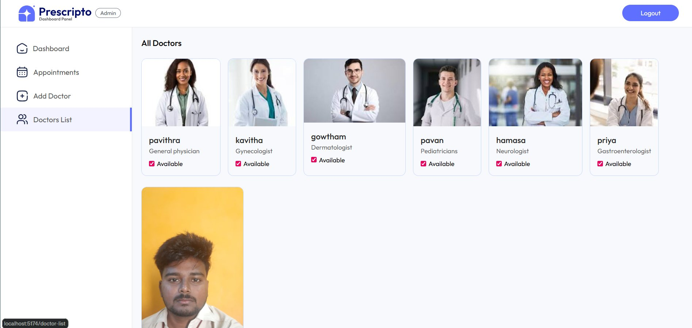
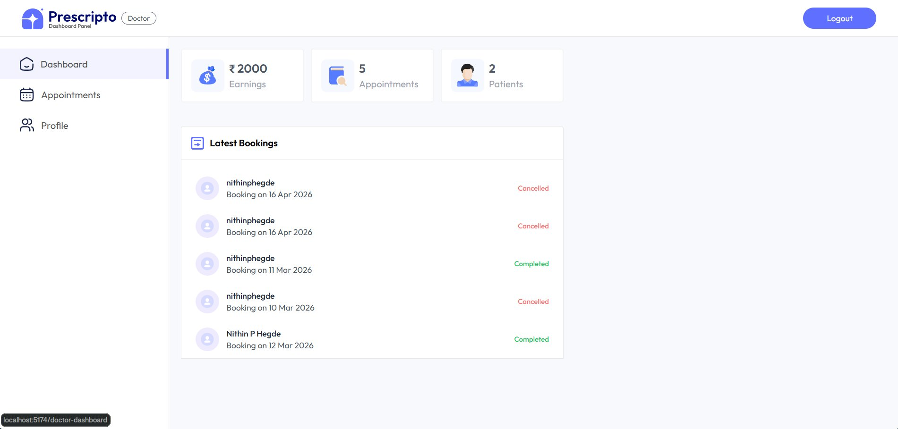
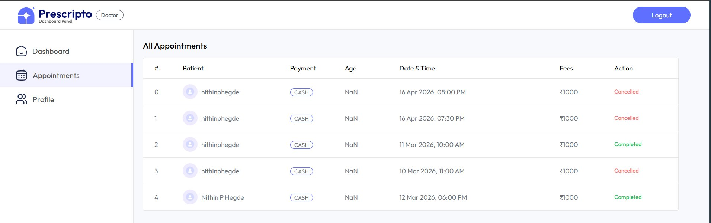
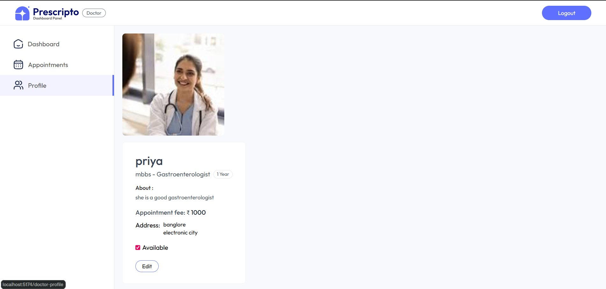

# Prescripto — Doctor Appointment Booking System

A full-stack MERN web application that enables patients to discover doctors, book appointments, and manage their healthcare — while giving doctors and admins dedicated dashboards to manage their workflows.



---

## Table of Contents

- [Overview](#overview)
- [Features](#features)
- [Tech Stack](#tech-stack)
- [Project Structure](#project-structure)
- [Getting Started](#getting-started)
- [Environment Variables](#environment-variables)
- [API Reference](#api-reference)
- [Screenshots](#screenshots)

---

## Overview

Prescripto is a three-part MERN stack application:

| App | Description | Port |
|-----|-------------|------|
| **Frontend** | Patient-facing booking portal | 5173 |
| **Admin Panel** | Admin & Doctor management dashboard | 5174 |
| **Backend** | REST API server | 4000 |

Patients can register, search doctors by speciality, view available time slots, and book or cancel appointments. Doctors get their own dashboard to manage appointments and update their profile. Admins have full control over doctors, appointments, and platform analytics.

---

## Features

### 👤 Patient (Frontend)
- Register & login with JWT authentication
- Browse doctors filtered by speciality (General Physician, Gynecologist, Dermatologist, Pediatrician, Neurologist, Gastroenterologist)
- View doctor profiles — qualifications, experience, fees, availability
- Book appointments with real-time slot availability
- Cancel booked appointments (slot is freed automatically)
- View and manage all upcoming appointments
- Edit personal profile including photo upload (via Cloudinary)

### 🩺 Doctor Panel
- Secure doctor login
- View all assigned appointments
- Mark appointments as **completed** or **cancelled**
- View earnings and patient stats on a personal dashboard
- Update profile information and toggle availability

### 🛠️ Admin Panel
- Admin login with separate credentials
- Add new doctors with photo upload, speciality, degree, experience, and fee
- View and manage all doctors — toggle availability
- View all appointments across the platform and cancel any
- Admin dashboard with key metrics: doctors, appointments, patients

---

## Tech Stack

**Frontend & Admin**
- React 18 + Vite
- React Router DOM v6
- Tailwind CSS
- Axios
- React Toastify

**Backend**
- Node.js + Express
- MongoDB Atlas + Mongoose
- JWT — auth for users, doctors, and admin independently
- Bcrypt — password hashing
- Multer — file upload handling
- Cloudinary — image storage (doctor photos, profile pictures)
- Validator — input validation

---

## Project Structure

```
prescripto/
├── frontend/          # Patient-facing React app
│   └── src/
│       ├── components/   # Navbar, Footer, Header, Banner, etc.
│       ├── pages/        # Home, Doctors, Appointment, MyProfile, etc.
│       └── context/      # AppContext (global state)
│
├── admin/             # Admin + Doctor React dashboard
│   └── src/
│       ├── components/   # Navbar, Sidebar
│       ├── pages/
│       │   ├── Admin/    # Dashboard, AllAppointments, AddDoctor, DoctorsList
│       │   └── Doctor/   # DoctorDashboard, DoctorAppointments, DoctorProfile
│       └── context/      # AdminContext, DoctorContext, AppContext
│
└── backend/           # Express REST API
    ├── config/        # MongoDB & Cloudinary setup
    ├── controllers/   # adminController, doctorController, userController
    ├── middleware/    # authAdmin, authDoctor, authUser, multer
    ├── models/        # appointmentModel, doctorModel, userModel
    └── routes/        # adminRoute, doctorRoute, userRoute
```

---

## Getting Started

### Prerequisites

- Node.js v20 LTS (recommended — v22+ has OpenSSL compatibility issues with MongoDB)
- MongoDB Atlas account
- Cloudinary account

### 1. Clone the repository

```bash
git clone https://github.com/your-username/prescripto.git
cd prescripto
```

### 2. Backend

```bash
cd backend
npm install
npm run server
```

### 3. Frontend

```bash
cd frontend
npm install
npm run dev
```

### 4. Admin Panel

```bash
cd admin
npm install
npm run dev
```

---

## Environment Variables

Create a `.env` file inside the `backend/` folder:

```env
# MongoDB
MONGODB_URI=mongodb+srv://<username>:<password>@cluster.mongodb.net

# JWT
JWT_SECRET=your_jwt_secret_key

# Cloudinary
CLOUDINARY_NAME=your_cloud_name
CLOUDINARY_API_KEY=your_api_key
CLOUDINARY_SECRET_KEY=your_api_secret

# Admin credentials
ADMIN_EMAIL=admin@prescripto.com
ADMIN_PASSWORD=your_admin_password
```

Create a `.env` file inside `frontend/` and `admin/`:

```env
VITE_BACKEND_URL=http://localhost:4000
```

> ⚠️ Never commit `.env` files. They are already listed in `.gitignore`.

---

## API Reference

### User Routes — `/api/user`

| Method | Endpoint | Auth | Description |
|--------|----------|------|-------------|
| POST | `/register` | ❌ | Register new patient |
| POST | `/login` | ❌ | Patient login |
| GET | `/get-profile` | ✅ | Fetch patient profile |
| POST | `/update-profile` | ✅ | Update profile + photo |
| POST | `/book-appointment` | ✅ | Book an appointment |
| GET | `/appointments` | ✅ | List all appointments |
| POST | `/cancel-appointment` | ✅ | Cancel an appointment |

### Doctor Routes — `/api/doctor`

| Method | Endpoint | Auth | Description |
|--------|----------|------|-------------|
| POST | `/login` | ❌ | Doctor login |
| GET | `/list` | ❌ | Public list of doctors |
| GET | `/appointments` | ✅ | Doctor's appointments |
| POST | `/complete-appointment` | ✅ | Mark appointment complete |
| POST | `/cancel-appointment` | ✅ | Cancel appointment |
| GET | `/dashboard` | ✅ | Doctor dashboard stats |
| GET | `/profile` | ✅ | Get doctor profile |
| POST | `/update-profile` | ✅ | Update doctor profile |
| POST | `/change-availability` | ✅ | Toggle availability |

### Admin Routes — `/api/admin`

| Method | Endpoint | Auth | Description |
|--------|----------|------|-------------|
| POST | `/login` | ❌ | Admin login |
| POST | `/add-doctor` | ✅ | Add a new doctor |
| GET | `/all-doctors` | ✅ | List all doctors |
| POST | `/change-availability` | ✅ | Toggle doctor availability |
| GET | `/appointments` | ✅ | All platform appointments |
| POST | `/cancel-appointment` | ✅ | Cancel any appointment |
| GET | `/dashboard` | ✅ | Admin dashboard stats |

---

## Screenshots

### 🏠 Frontend — Home & Speciality Browse


### 📅 Frontend — Book an Appointment


### 🗓️ Frontend — My Appointments


---

### 🛠️ Admin — Dashboard


### 📋 Admin — All Appointments


### 👨‍⚕️ Admin — Doctors List


---

### 🩺 Doctor — Dashboard


### 📋 Doctor — Appointments


### 👤 Doctor — Profile


---

## License

This project is open source and available under the [MIT License](LICENSE).
